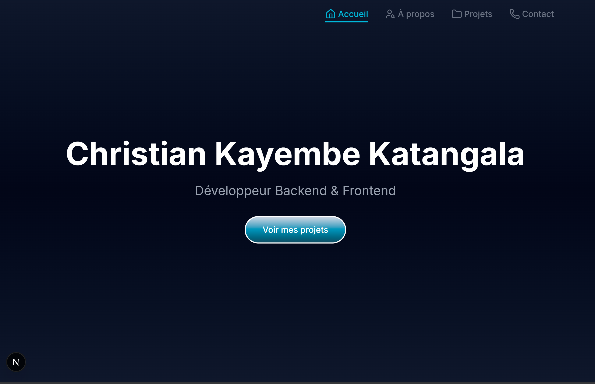
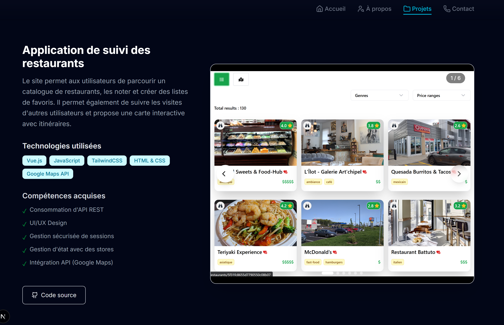

# Personal Portfolio

This repository contains the source code for my personal developer portfolio.

The portfolio showcases selected projects, technical skills, and experience through a clean and responsive interface.

## ✨ Features

- Project showcase with detailed descriptions
- Responsive design 
- Smooth animations and transitions
- Dark theme UI
- Contact section

## 🛠️ Tech Stack

- React / Next.js
- Tailwind CSS
- Framer Motion
- TypeScript

## 🚀 Live Demo
- It'll be added soon. Keep in touch!

## 📸 Screenshots

### Landing page

### Project example

## 📌 Notes

Some projects presented in this portfolio were developed in an academic or professional context.  
Certain details (code, architecture, or data) may be omitted or anonymized for confidentiality reasons.

## 📬 Contact

- LinkedIn: https://linkedin.com/in/christian-katangala-45311a391
- GitHub: https://github.com/katangalac